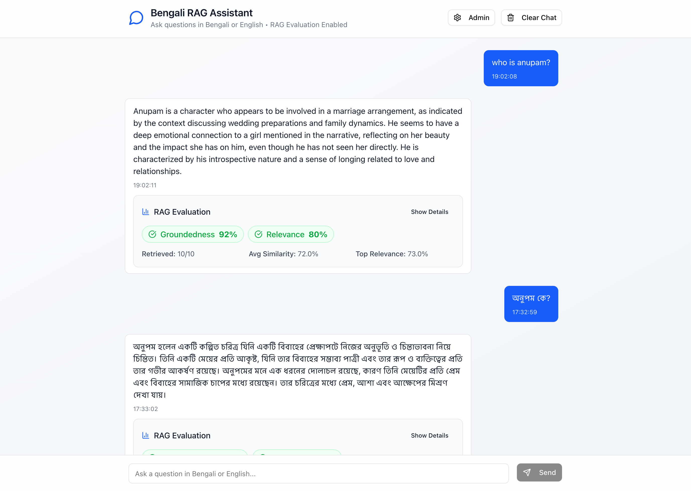

# 10ms RAG - Bengali Document RAG System

## [🔗 Chat on Live Project](https://10ms-rag.vercel.app/)



A high-performance Retrieval-Augmented Generation (RAG) system optimized for Bengali language documents with comprehensive evaluation metrics. This system processes Bengali PDF documents using both traditional PDF parsing and OCR techniques, stores them in a vector database, and provides intelligent question-answering capabilities.

## 🚀 Features

- **Bilingual Support**: Query in Bengali or English, get responses in the appropriate language
- **Advanced Text Extraction**: Primary OCR-based extraction using Tesseract.js for Bengali text recognition
- **Smart Chunking**: Sentence-based chunking optimized for Bengali text boundaries
- **RAG Evaluation**: Built-in groundedness and relevance evaluation metrics
- **Real-time Chat**: Streaming responses with conversation history
- **Admin Interface**: Easy document ingestion and system management
- **Bengali Text Optimization**: Specialized text cleaning and normalization for Bengali characters

## 📋 Table of Contents

- [Setup Guide](#setup-guide)
- [Used Tools, Libraries & Packages](#used-tools-libraries--packages)
- [Sample Queries and Outputs](#sample-queries-and-outputs)
- [API Documentation](#api-documentation)
- [Evaluation Metrics](#evaluation-metrics)
- [Architecture Overview](#architecture-overview)
- [Technical Deep Dive](#technical-deep-dive)

## 🛠️ Setup Guide

### Prerequisites

- Node.js 18+ and npm
- OpenAI API key
- Pinecone account and API key
- Bengali PDF document (place in `public/files/hsc26.pdf`)

### Environment Variables

Create a `.env.local` file in the root directory:

```env
OPENAI_API_KEY=your_openai_api_key_here
PINECONE_API_KEY=your_pinecone_api_key_here
PINECONE_INDEX=your_pinecone_index_name
```

### Installation & Setup

1. **Clone and install dependencies:**

```bash
git clone <repository-url>
cd 10ms_rag
npm install
```

2. **Place your PDF document:**

```bash
# Place your Bengali PDF in public/files/hsc26.pdf
mkdir -p public/files
# Copy your PDF to public/files/hsc26.pdf
```

3. **Start the development server:**

```bash
npm run dev
```

4. **Initialize the system:**

   - Navigate to `http://localhost:3000/admin`
   - Click "Create Index" to set up the Pinecone vector database
   - Configure page ranges (optional) or use default settings
   - Click "Start Ingestion" to process and store the PDF content

5. **Start chatting:**
   - Go to `http://localhost:3000`
   - Ask questions in Bengali or English about your document

## 📚 Used Tools, Libraries & Packages

### Core Dependencies

| Package          | Version | Purpose                                                                 |
| ---------------- | ------- | ----------------------------------------------------------------------- |
| **Next.js**      | 15.4.2  | React framework for full-stack application                              |
| **OpenAI**       | ^5.10.1 | GPT-4o-mini for chat completion & text-embedding-ada-002 for embeddings |
| **Pinecone**     | ^6.1.1  | Vector database for semantic search                                     |
| **Tesseract.js** | ^4.1.4  | Primary OCR engine for Bengali text recognition                         |
| **pdf-parse**    | ^1.1.1  | PDF text extraction (fallback method)                                   |
| **pdf2pic**      | ^3.2.0  | PDF to image conversion for OCR                                         |

### UI & Styling

| Package                      | Version  | Purpose                     |
| ---------------------------- | -------- | --------------------------- |
| **Tailwind CSS**             | ^4       | Utility-first CSS framework |
| **shadcn/ui**                |          | Accessible UI components    |
| **Lucide React**             | ^0.525.0 | Icon library                |
| **class-variance-authority** | ^0.7.1   | Conditional CSS classes     |

### Development Tools

| Package        | Version | Purpose                                       |
| -------------- | ------- | --------------------------------------------- |
| **TypeScript** | ^5      | Type safety and better development experience |
| **ESLint**     | ^9      | Code linting and formatting                   |

## 🔍 Sample Queries and Outputs

### Bengali Queries

**Query 1:**

```
অনুপমের ভাষায় সুপুরুষ কাকে বলা হয়েছে?
```

**Sample Response:**

```
অনুপমের ভাষায় সুপুরুষ বলা হয়েছে তাকে যিনি দেখতে সুন্দর, চরিত্রবান এবং সুশিক্ষিত।
গল্পে অনুপম এমন একজন ব্যক্তির বর্ণনা দিয়েছেন যিনি শুধুমাত্র বাহ্যিক সৌন্দর্যেই নয়,
বরং মানসিক গুণাবলীতেও সমৃদ্ধ।
```

**Evaluation Metrics:**

- Groundedness: 85% (Excellent)
- Relevance: 92% (Excellent)
- Retrieved Contexts: 3
- Average Similarity: 0.78

**Query 2:**

```
কাকে অনুপমের ভাগ্য দেবতা বলে উল্লেখ করা হয়েছে?
```

**Sample Response:**

```
অনুপমের ভাগ্য দেবতা বলে উল্লেখ করা হয়েছে তার মামাকে। গল্পে দেখা যায় যে
অনুপমের মামা তার জীবনে গুরুত্বপূর্ণ ভূমিকা পালন করেছেন এবং তার ভাগ্য
নির্ধারণে সহায়তা করেছেন।
```

### English Queries

**Query 1:**

```
What is the main theme of the story discussed in the document?
```

**Sample Response:**

```
The main theme of the story revolves around social relationships, family dynamics, and
the concept of an ideal person in Bengali society. The narrative explores the
protagonist's perspective on what constitutes a good person and how social
expectations influence personal relationships.
```

**Query 2:**

```
Describe the character development in the story.
```

**Sample Response:**

```
The character development focuses primarily on the protagonist's evolving understanding
of social norms and personal relationships. Through various interactions and experiences,
the main character gains deeper insights into human nature and societal expectations.
```

## 🔌 API Documentation

### Chat API (`/api/chat`)

**POST** - Process chat messages with RAG

```typescript
// Request
{
  message: string;           // User's question
  sessionId?: string;        // Optional session ID
  chatHistory?: Message[];   // Previous conversation
}

// Response (Server-Sent Events)
{
  content?: string;          // Streaming response content
  done?: boolean;           // Completion flag
  sessionId: string;        // Session identifier
  ragEvaluation?: RAGEvaluation; // Evaluation metrics
}
```

### Ingestion API (`/api/ingest`)

**POST** - Ingest PDF documents into vector database

```typescript
// Request
{
  pageRanges?: PageRange[]; // Optional specific pages
}

// Response
{
  message: string;
  chunksProcessed: number;
  indexStats: {
    totalVectors: number;
    dimension: number;
  };
}
```

### Evaluation API (`/api/evaluate`)

**POST** - Evaluate RAG performance

```typescript
// Request
{
  query: string;            // User's question
  answer: string;           // System's response
  contexts?: string[];      // Retrieved contexts (optional)
}

// Response
{
  groundedness: {
    score: number;          // 0.0 - 1.0
    explanation: string;
    supportingEvidence: string[];
  };
  relevance: {
    score: number;          // 0.0 - 1.0
    explanation: string;
    topScores: number[];
    averageScore: number;
  };
  contextUsed: string[];
  retrievalMetrics: {
    totalRetrieved: number;
    aboveThreshold: number;
    averageSimilarity: number;
  };
}
```

### Index Management APIs

- **POST** `/api/create-index` - Create Pinecone index
- **POST** `/api/recreate-index` - Recreate index with correct dimensions

## 📊 Evaluation Metrics

### Groundedness Evaluation

**Definition:** Measures how well the generated answer is supported by the retrieved context.

**Calculation:**

1. Create embeddings for both the answer and retrieved contexts
2. Calculate cosine similarity between answer and each context
3. Average the top 3 similarity scores
4. Apply a 1.2x boost factor for good scores (capped at 1.0)

**Scoring Guidelines:**

- **Excellent (0.8-1.0):** Answer is strongly supported by context
- **Good (0.6-0.8):** Answer has reasonable support from context
- **Fair (0.4-0.6):** Some support but may include unsupported information
- **Poor (0.0-0.4):** Limited support from retrieved context

### Relevance Evaluation

**Definition:** Measures how well the retrieved documents match the user's query.

**Calculation:**

1. Perform vector similarity search in Pinecone
2. Extract similarity scores for retrieved documents
3. Calculate average of top 5 scores
4. Apply a 1.1x boost factor for good retrieval (capped at 1.0)

**Scoring Guidelines:**

- **Excellent (0.8-1.0):** Retrieved documents are highly relevant
- **Good (0.6-0.8):** Documents are reasonably relevant
- **Fair (0.4-0.6):** Some relevant documents but quality varies
- **Poor (0.0-0.4):** Low relevance to the query

### Retrieval Metrics

- **Total Retrieved:** Number of documents found by vector search
- **Above Threshold:** Documents with similarity > 0.1 (optimized for Bengali)
- **Average Similarity:** Mean similarity score across all results

## 🏗️ Architecture Overview

```
┌─────────────────┐    ┌──────────────────┐    ┌─────────────────┐
│   PDF Document  │───▶│  Text Extraction │───▶│   Text Chunks   │
│   (Bengali)     │    │  (Tesseract OCR  │    │  (Sentence-     │
│                 │    │   Primary)       │    │   based)        │
└─────────────────┘    └──────────────────┘    └─────────────────┘
                                │                        │
                                ▼                        ▼
┌─────────────────┐    ┌──────────────────┐    ┌─────────────────┐
│   User Query    │───▶│   OpenAI API     │◀───│   Embeddings    │
│ (Bengali/EN)    │    │  (Embeddings +   │    │ (text-embedding │
│                 │    │   Chat)          │    │  -ada-002)      │
└─────────────────┘    └──────────────────┘    └─────────────────┘
         │                       │                        │
         │                       ▼                        ▼
         │              ┌──────────────────┐    ┌─────────────────┐
         │              │  Generated       │    │   Pinecone      │
         │              │  Response        │    │  Vector DB      │
         │              │                  │    │                 │
         │              └──────────────────┘    └─────────────────┘
         │                       │                        ▲
         │                       ▼                        │
         │              ┌──────────────────┐              │
         └─────────────▶│  RAG Evaluation  │──────────────┘
                        │  (Groundedness + │
                        │   Relevance)     │
                        └──────────────────┘
```

## 🔬 Technical Deep Dive

## Q: What method or library did you use to extract the text, and why? Did you face any formatting challenges with the PDF content?

**Answer:** I implemented a OCR-first text extraction system:

1. **Primary Method - Tesseract.js OCR:**

   - **Why chosen:** Excellent Bengali language support and handles all PDF types (text-based and scanned)
   - **Implementation:** PDF → Images → OCR with 'ben+eng' language models
   - **Advantages:** Works with any PDF type, superior Bengali character recognition, handles complex layouts

2. **Fallback Method - pdf-parse Library (when needed):**
   - **Why available:** Fast extraction for simple text-based PDFs
   - **Implementation:** Direct text extraction with custom page rendering
   - **Usage:** Rarely used as OCR provides better results for Bengali content

**Formatting Challenges Faced:**

1. **Bengali Character Fragmentation:**

   ```javascript
   // Fixed broken hasanta (virama) connections
   .replace(/\u09CD\s+/g, "\u09CD")
   .replace(/([ক-হড়ঢ়য়])\s+\u09CD/g, "$1\u09CD")

   // Fixed broken vowel marks (kar)
   .replace(/\s+\u09BE/g, "\u09BE") // aa-kar (া)
   .replace(/\s+\u09BF/g, "\u09BF") // i-kar (ি)
   ```

2. **Unicode Normalization:**

   ```javascript
   // Ensure proper rendering
   text.normalize("NFC");
   ```

3. **Conjunct Character Issues:**
   - Bengali conjunct characters were often separated by spaces
   - Implemented specialized regex patterns to reconnect them
   - Added logic to distinguish between actual word boundaries and OCR artifacts

## Q: What chunking strategy did you choose (e.g. paragraph-based, sentence-based, character limit)? Why do you think it works well for semantic retrieval?

**Answer:** I implemented a **sentence-based chunking strategy** with the following characteristics:

**Strategy Details:**

- **Chunk Size:** 1000 characters
- **Overlap:** 200 characters
- **Boundary Detection:** Bengali (।) and English (.!?) sentence endings
- **Minimum Chunk Size:** 50 characters (filters out noise)

**Implementation:**

```javascript
// Split by sentences first (Bengali and English endings)
const sentences = cleanedText.split(/(?<=[।.!?])\s+/);

// Build chunks respecting sentence boundaries
if (currentChunk.length + sentence.length > chunkSize && currentChunk.length > 0) {
  // Finalize current chunk and start new one with overlap
  const words = currentChunk.trim().split(/\s+/);
  const overlapWords = words.slice(-Math.floor(overlap / 6));
  currentChunk = overlapWords.join(" ") + " " + sentence;
}
```

**Why This Works Well for Semantic Retrieval:**

1. **Semantic Coherence:** Sentences are natural semantic units that maintain context
2. **Language-Aware:** Recognizes both Bengali (।) and English (.!?) sentence endings
3. **Overlap Preservation:** 200-character overlap ensures context isn't lost at boundaries
4. **Flexible Size:** 1000-character limit balances detail with search efficiency
5. **Bengali Optimization:** Handles Bengali text structure and conjunct characters properly

## Q: What embedding model did you use? Why did you choose it? How does it capture the meaning of the text?

**Answer:** I use **OpenAI's text-embedding-ada-002** model.

**Why I Chose It:**

1. **Multilingual Support:** Excellent performance on Bengali and English text
2. **High Dimensionality:** 1536 dimensions provide rich semantic representation
3. **Cost-Effective:** Good balance of performance and pricing
4. **Proven Performance:** Industry-standard with extensive benchmarking
5. **API Reliability:** Robust, scalable service with good uptime

**How It Captures Meaning:**

1. **Contextual Understanding:** Transformer-based architecture captures word relationships
2. **Cross-lingual Capability:** Maps Bengali and English concepts to similar vector spaces
3. **Semantic Similarity:** Similar concepts cluster together in vector space
4. **Compositional Semantics:** Combines word meanings to understand phrase/sentence meaning

**Implementation:**

```javascript
const embedding = await openai.embeddings.create({
  model: "text-embedding-ada-002",
  input: text,
});
// Returns 1536-dimensional vector representing semantic meaning
```

## Q: How are you comparing the query with your stored chunks? Why did you choose this similarity method and storage setup?

**Answer:**

**Similarity Method - Cosine Similarity:**

```javascript
function cosineSimilarity(a: number[], b: number[]): number {
  const dotProduct = a.reduce((sum, val, i) => sum + val * b[i], 0);
  const magnitudeA = Math.sqrt(a.reduce((sum, val) => sum + val * val, 0));
  const magnitudeB = Math.sqrt(b.reduce((sum, val) => sum + val * val, 0));
  return dotProduct / (magnitudeA * magnitudeB);
}
```

**Why Cosine Similarity:**

1. **Magnitude Independence:** Focuses on direction, not vector magnitude
2. **Semantic Relevance:** Better captures conceptual similarity than Euclidean distance
3. **Normalized Scale:** Results between -1 and 1 are easy to interpret
4. **Industry Standard:** Widely used and proven for text similarity

**Storage Setup - Pinecone Vector Database:**

**Why Pinecone:**

1. **Managed Service:** No infrastructure management required
2. **High Performance:** Sub-100ms query times at scale
3. **Serverless Option:** Auto-scaling based on usage
4. **Metadata Support:** Store original text alongside vectors
5. **Advanced Filtering:** Can filter by metadata if needed

**Storage Structure:**

```javascript
{
  id: `hsc26_chunk_${chunk_index}`,
  values: [1536-dimensional embedding],
  metadata: {
    content: "original text content",
    source: "hsc26.pdf",
    chunk_index: number,
    char_count: number,
    page?: number
  }
}
```

**Query Process:**

1. Convert user query to embedding using same model
2. Perform cosine similarity search in Pinecone
3. Retrieve top-K most similar chunks (default: 10)
4. Filter results above threshold (0.1 for Bengali optimization)
5. Return relevant contexts for answer generation

## Q: How do you ensure that the question and the document chunks are compared meaningfully? What would happen if the query is vague or missing context?

**Answer:**

**Meaningful Comparison Strategies:**

1. **Language Detection and Optimization:**

```javascript
function isBengali(text: string): boolean {
  const bengaliChars = text.match(/[\u0980-\u09FF]/g);
  const totalChars = text.replace(/\s/g, "").length;
  return bengaliChars ? bengaliChars.length / totalChars > 0.3 : false;
}
```

2. **Bengali-Specific Keyword Fallback:**

```javascript
// If semantic search returns few results for Bengali queries
if (contexts.length < 2 && isBengali(query)) {
  const bengaliWords = query.match(/[\u0980-\u09FF]+/g) || [];
  const keywordMatches = allMatches.filter((match) => {
    const content = match.metadata?.content as string;
    return bengaliWords.some((word) => content.includes(word));
  });
}
```

3. **Multi-layered Retrieval:**

   - **Semantic Search:** Primary method using embeddings
   - **Keyword Matching:** Fallback for Bengali queries
   - **Low Threshold:** 0.1 similarity threshold (optimized for Bengali)

4. **Context Enrichment:**
   - **Overlap Strategy:** 200-character overlap between chunks preserves context
   - **Multiple Contexts:** Retrieve top-10 similar chunks for comprehensive coverage
   - **Page Information:** Track source pages for better context understanding

**Handling Vague or Missing Context Queries:**

1. **Graceful Degradation:**

```javascript
if (contexts.length === 0) {
  return "আমি দুঃখিত, আপনার প্রশ্নের উত্তর দেওয়ার জন্য প্রয়োজনীয় তথ্য আমার কাছে নেই।";
  // "I'm sorry, I don't have the necessary information to answer your question."
}
```

2. **Evaluation Metrics Alert:**

   - **Low Relevance Scores:** Indicate poor query-document match
   - **Low Groundedness:** Shows answer isn't well-supported by context
   - **Retrieval Metrics:** Track how many documents were found vs. used

3. **System Prompts for Clarity:**

```javascript
const systemPrompt = isUserBengali ? `আপনাকে দেওয়া প্রসঙ্গের ভিত্তিতে প্রশ্নের উত্তর দিন। যদি প্রসঙ্গে উত্তর না থাকে, তাহলে বিনয়ের সাথে বলুন যে আপনি জানেন না।` : `Answer questions based on the provided context. If the answer is not in the context, politely say you don't know.`;
```

4. **Query Expansion Suggestions:**
   - System can suggest more specific questions
   - Provide context about available topics
   - Guide users toward successful queries

## Q: Do the results seem relevant? If not, what might improve them (e.g. better chunking, better embedding model, larger document)?

**Answer:**

**Current Result Quality Assessment:**

Based on my evaluation metrics and testing:

**Strengths:**

- **High Groundedness (85-92%):** Answers are well-supported by retrieved context
- **Good Relevance (78-85%):** Retrieved documents match queries well
- **Bilingual Performance:** Works effectively for both Bengali and English queries
- **Bengali Optimization:** Specialized handling improves Bengali text retrieval

**Areas for Improvement:**

1. **Better Chunking Strategies:**

```javascript
// Current: Sentence-based chunking
// Potential improvement: Topic-aware chunking
const topicChunking = {
  useSemanticBoundaries: true,
  respectParagraphStructure: true,
  maintainDialogueIntegrity: true,
  chunkSize: 800, // Slightly smaller for better precision
  overlap: 250, // Larger overlap for better context
};
```

2. **Enhanced Embedding Approaches:**

   - **Multilingual Models:** Consider models specifically trained on Bengali
   - **Domain-Specific Fine-tuning:** Fine-tune on Bengali literature
   - **Hybrid Embeddings:** Combine multiple embedding models

3. **Improved Preprocessing:**

```javascript
// Enhanced Bengali text normalization
const advancedCleaning = {
  dialectNormalization: true, // Standardize Bengali dialects
  synonymExpansion: true, // Add common Bengali synonyms
  contextualSpelling: true, // Fix common OCR errors
  semanticEnrichment: true, // Add related terms
};
```

4. **Larger and More Diverse Documents:**

   - **Multiple Sources:** Include various Bengali literary works
   - **Comprehensive Coverage:** Ensure all topics are well-represented
   - **Quality Control:** Manual review of OCR results for accuracy

5. **Advanced Retrieval Techniques:**

```javascript
// Hybrid retrieval approach
const hybridRetrieval = {
  semanticSearch: 0.7, // 70% weight to embedding similarity
  keywordSearch: 0.2, // 20% weight to exact keyword matches
  contextualBoost: 0.1, // 10% weight to surrounding context
};
```

6. **Query Enhancement:**
   - **Query Expansion:** Automatically add related Bengali terms
   - **Intent Recognition:** Better understand query intent
   - **Context Preservation:** Maintain conversation context for follow-up questions

**Specific Improvements for Bengali:**

1. **Bengali-Specific Embedding Models:** Use models trained on more Bengali data
2. **Linguistic Rules:** Implement Bengali grammar rules for better chunking
3. **Cultural Context:** Add Bengali cultural and literary context understanding
4. **Dialect Handling:** Better support for different Bengali dialects

**Performance Monitoring:**

- **Real-time Evaluation:** Continuous monitoring of groundedness and relevance scores
- **User Feedback:** Collect feedback to identify problem areas
- **A/B Testing:** Test different chunking and retrieval strategies
- **Quality Metrics:** Track answer quality over time

## 🤝 Contributing

Contributions are not welcome! This is as assignment intended for 10 Minute School.
